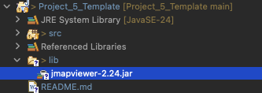
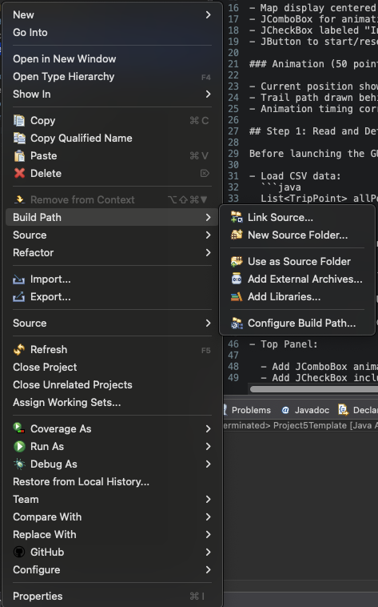
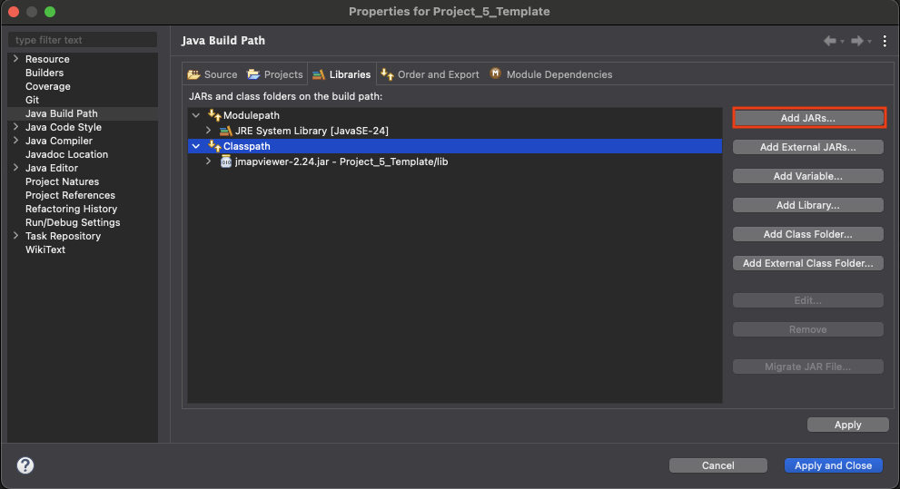
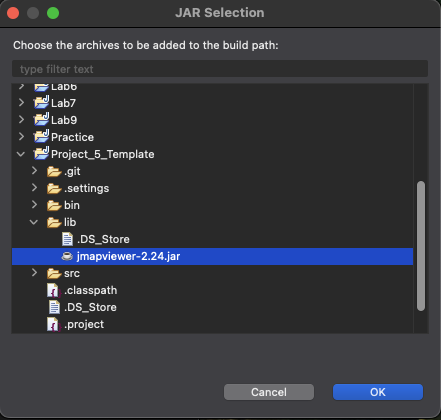

# Project 5: Trip Animation GUI

This guide will walk you through building the required map-animation application using Java Swing and JMapViewer.

## Prerequisites

- JDK 8 or higher (JDK 11+ recommended)
- JMapViewer JAR included in the project lib folder
- TripPoint.java and StopDetector classes prepared
- IconMarker.java and raccoon image resource if using a custom marker

## Grading Rubric Overview (50 pts GUI + 50 pts Animation)

### GUI Components (50 points)

- Map display centered on trip area (20 pts)
- JComboBox for animation speed: 15, 30, 60, 90 seconds (10 pts)
- JCheckBox labeled "Include Stops" (10 pts)
- JButton to start/reset animation (10 pts)

### Animation (50 points)

- Current position shown with raccoon icon (10 pts)
- Trail path drawn behind raccoon (10 pts)
- Animation timing correctly matches selected duration (30 pts)

## Step 1: Read and Detect Stops

Before launching the GUI, load trip data and detect stops.

- Load CSV data:
  ```java
  List<TripPoint> allPoints = TripPoint.loadFromFile("triplog.csv");
  ```
- Detect moving points:
  ```java
  List<TripPoint> movingPoints = StopDetector.h1(allPoints);
  ```

Store `allPoints` and `movingPoints` for later use in animation.

## Step 2: Build the GUI Skeleton

Start from the provided Project5Template.java. Fill in the TODOs.

- Top Panel:
  - Add JComboBox animationCombo with values {"15", "30", "60", "90"}.
  - Add JCheckBox includeStopsCheckbox, default unchecked.
  - Add JButton playButton labeled "Play".

- Map Panel:
  - Instantiate JMapViewer mapViewer.
  - Enable wrap-around scrolling.
  - Center the map using coordinates of your trip.

## Step 3: Attach Listeners

Attach an ActionListener to the Play button.

```java
playButton.addActionListener(e -> {
    mapViewer.removeAllMapMarkers();
    mapViewer.removeAllMapPolygons();

    List<TripPoint> data = includeStopsCheckbox.isSelected() ? allPoints : movingPoints;
    int seconds = Integer.parseInt((String) animationCombo.getSelectedItem());

    animateTrip(data, seconds);
});
```

## Step 4: Implement animateTrip Method

Use a Swing Timer for animation.

```java
int delay = (seconds * 1000) / points.size();
Timer timer = new Timer(delay, null);
final int[] index = {0};
timer.addActionListener(evt -> {
    if (index[0] >= points.size()) {
        ((Timer) evt.getSource()).stop();
        return;
    }

    TripPoint p = points.get(index[0]);
    // Update raccoon marker position
    // Draw line from previous to current point

    index[0]++;
    mapViewer.repaint();
});
timer.start();
```

- Raccoon marker should replace or move.
- Line should connect previous and current TripPoint.

## Additional Recommendations

- Keep model and view code separated.
- Use resources properly (raccoon.png inside resources folder).
- Make sure animation timing matches total seconds accurately.
- Clear old markers and lines before starting a new animation.
- Make sure the trip centers properly on load or after play.

## How to Add JMapViewer to Your Eclipse Project

Follow these steps to properly add `jmapviewer-2.24.jar` to your Eclipse project.

### Step 1: Create a `lib` Folder
- In your project root (e.g., `cs2334sp23project5`), create a new folder called `lib` if it doesn’t already exist.
- Place your `jmapviewer-2.24.jar` file into this `lib` folder.

### Step 2: Add the JAR to the Build Path
1. In Eclipse, right-click the project name in the Project Explorer.
   
2. Navigate to `Build Path → Configure Build Path…`  
      
3. Go to the `Libraries → Classpath` tab and click `Add JARs…`  
   
4. Navigate to the `lib` folder inside your project and select `jmapviewer-2.24.jar`
   
5. Click `OK`, then click `Apply and Close`

### Step 3: Confirm the Classpath
- You should now see `jmapviewer-2.24.jar` listed under `Classpath` in the Build Path window  

- You should also see it listed under `Referenced Libraries` in the Project Explorer  

### Step 4: Remove `module-info.java` (if present)
If your project has a file named `module-info.java`, delete it. This file is not required and can interfere with importing external libraries like JMapViewer.


